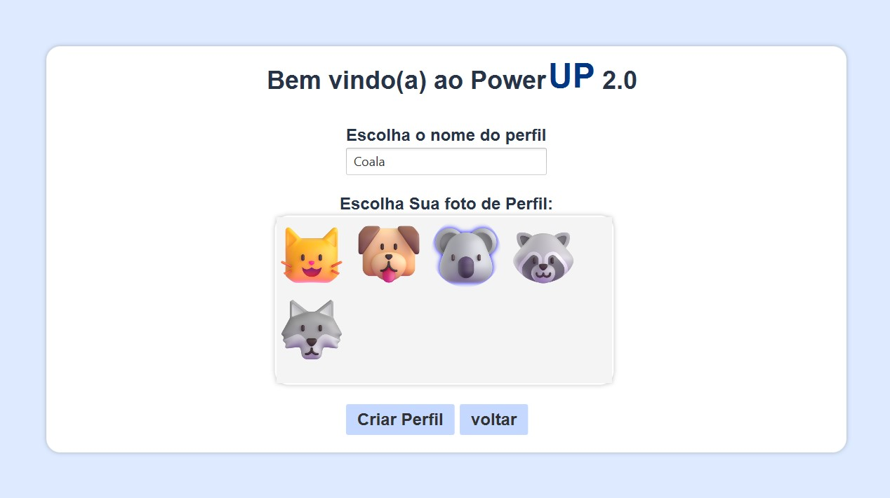
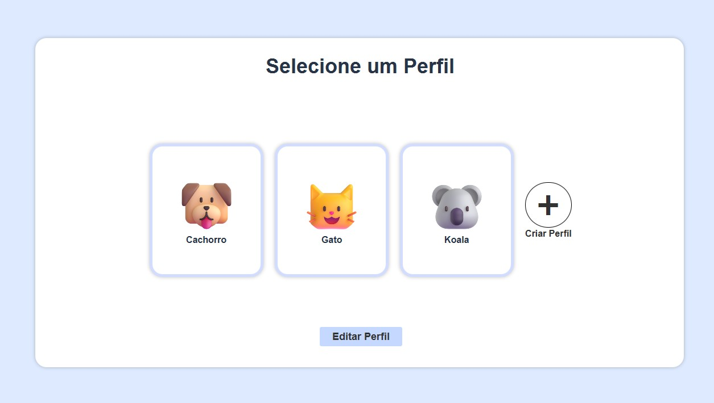

# PowerUP-2.0  
A primeira versão do powerUp foi um projeto em java para uma cadeira da universidade, mas eu não fiquei satisfeito com o resultado (o projeto era em grupo mas eu fiz tudo praticamente sozinho).  
Agora estou criando um novo powerUp mas dessa vez com mais calma e carinho.

## Funções criadas até agora:  
Por enquanto o aplicativo tem apenas um gerenciador de perfis, quando eu tiver mais tempo livre vou começar a fazer o app principal.

  
O usuário pode criar até 6 perfis, e pode adicionar mais imagens na pasta de fotosPerfil.
  

